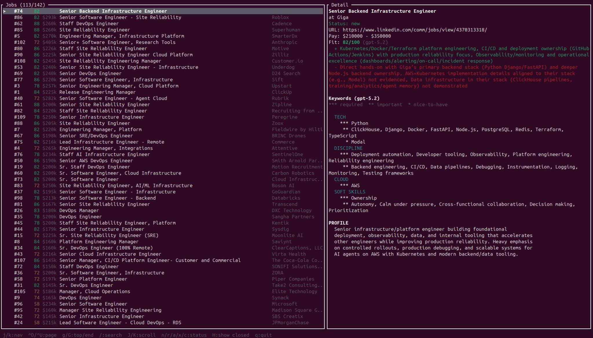

<p align="center">
  
</p>

<h1 align="center">Hunt for a job, skip the grind.</h1>

<p align="center">
  Find, track, and analyze opportunities from the terminal.
</p>

<p align="center">
  
  
  
</p>

---

`hunt` is a Rust CLI that replaces the spreadsheet-and-bookmarks approach to job searching. It ingests job alerts from email, fetches full descriptions via browser automation, deduplicates postings, and uses AI to extract keywords, analyze fit against your resume, and generate tailored resume variants.

## Features

- **Email ingestion** — Pull job alerts from Gmail (LinkedIn, Indeed) via IMAP
- **Browser fetching** — Scrape full job descriptions with Selenium/geckodriver, handle JS-rendered pages and "Show more" buttons
- **Deduplication** — Fuzzy title matching (Jaro-Winkler > 0.8), substring matching, URL dedup
- **AI analysis** — Analyze postings, extract domain-categorized keywords with weights, fit analysis, full resume tailoring
- **Multi-model AI** — Claude via CLI (subscription), direct Anthropic API, OpenAI API
- **Resume management** — Store base resumes, generate tailored variants per job/model/format
- **Employer research** — Track startup info, public company controversies, PE/VC ownership
- **Ranking** — Score jobs by pay, employer status, and application stage

### Browse TUI

<p align="center">
  
</p>

## Quick start

```bash
# Build
cargo build --release

# Initialize the database
hunt init

# Add a job manually
hunt add "Senior DevOps Engineer at Acme Corp..."

# Or pull from email
hunt email --username you@gmail.com --password-file ~/.gmail.app_password.txt

# Fetch full descriptions from URLs
hunt fetch 5                    # single job
hunt fetch --all --limit 20     # batch

# List and rank
hunt list --status new
hunt rank --limit 10
```

## AI-powered analysis

AI commands default to `claude-sonnet` via the Claude Code CLI (no API key needed if you have a subscription). Pass `--model` to switch.

```bash
# Analyze a job posting
hunt analyze 5

# Extract keywords (grouped by domain, weighted by importance)
hunt keywords 5
hunt keywords 5 --show           # view stored keywords without re-running AI
hunt keywords --search terraform  # search across all jobs

# Resume fit analysis
hunt fit 5 --resume devops-2026

# Generate a tailored resume
hunt resume tailor 5 --resume devops-2026
hunt resume tailor 5 --resume devops-2026 --models claude-sonnet,gpt-5.2
hunt resume compare 5            # compare variants side by side
```

### Keyword output

Keywords are categorized into four domains with importance weights:

```
Keywords for job #5: Engineering Manager, Infrastructure Platform (model: claude-sonnet)

  *** = required   ** = important   * = nice-to-have

  TECH
    *** Kubernetes, Terraform
     ** PostgreSQL, Python
      * Airflow, Go, Snowflake, TypeScript, dbt

  DISCIPLINE
    *** DevOps, SRE, microservices
     ** CI/CD, Kanban

  CLOUD
    *** AWS

  SOFT SKILLS
    *** leadership, communication
     ** mentoring, planning

  PROFILE
  Tech-heavy infrastructure role. Strong emphasis on AWS/Terraform/Kubernetes
  stack with DevOps ownership. Leadership expectations high — managing a team,
  not just individual contribution.
```

### Available models

| Short name | Provider | Notes |
|------------|----------|-------|
| `claude-sonnet` (default) | Claude CLI | Uses Claude Code subscription |
| `claude-opus`, `claude-haiku` | Claude CLI | Subscription billing |
| `api-sonnet`, `api-opus`, `api-haiku` | Anthropic API | Requires `ANTHROPIC_API_KEY` |
| `gpt-5.2`, `gpt-4o`, `o3` | OpenAI API | Requires `OPENAI_API_KEY` |

## Employer management

```bash
hunt employer list
hunt employer show "Acme Corp"
hunt employer block "Evil Inc"      # never apply
hunt employer yuck "Meh LLC"        # apply reluctantly
hunt employer ok "Redeemed Co"      # clear status

# Research
hunt employer research "Startup Co" # YC, funding, HN mentions
hunt employer evil "Big Corp"       # controversies, labor practices
hunt employer ownership "Acquired"  # parent company, PE/VC
```

## Data management

```bash
# Cleanup
hunt cleanup --artifacts            # remove nav junk from email parsing
hunt cleanup --duplicates           # deduplicate jobs
hunt cleanup --all --dry-run        # preview all cleanup

# Destroy everything
hunt destroy                        # preview
hunt destroy --confirm              # actually wipe
```

## Architecture

| Module | Purpose |
|--------|---------|
| `main.rs` | CLI (clap), command dispatch, display formatting |
| `db.rs` | SQLite schema, migrations, all queries |
| `ai.rs` | `AIProvider` trait, three providers, prompt functions |
| `models.rs` | Data structs (`Job`, `Employer`, `JobKeyword`, etc.) |
| `email.rs` | IMAP ingestion, LinkedIn/Indeed HTML parsing |
| `browser.rs` | Selenium-based job description fetching |

Database is stored at `~/.local/share/hunt/hunt.db` (XDG). Schema auto-migrates on `init` or first use.

## Building from source

Requires Rust 2024 edition. Warnings are treated as errors.

```bash
cargo build --release
ln -sf "$(pwd)/target/release/hunt" ~/.local/bin/hunt
```

For browser fetching, you also need geckodriver:

```bash
geckodriver --port 4444 &
hunt fetch 5
```
